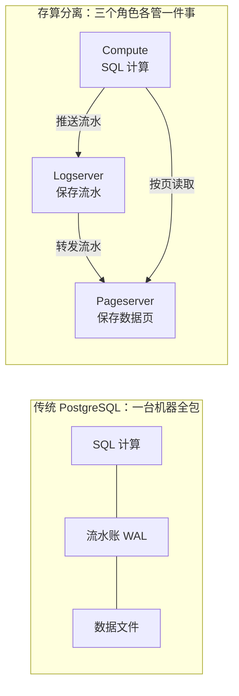
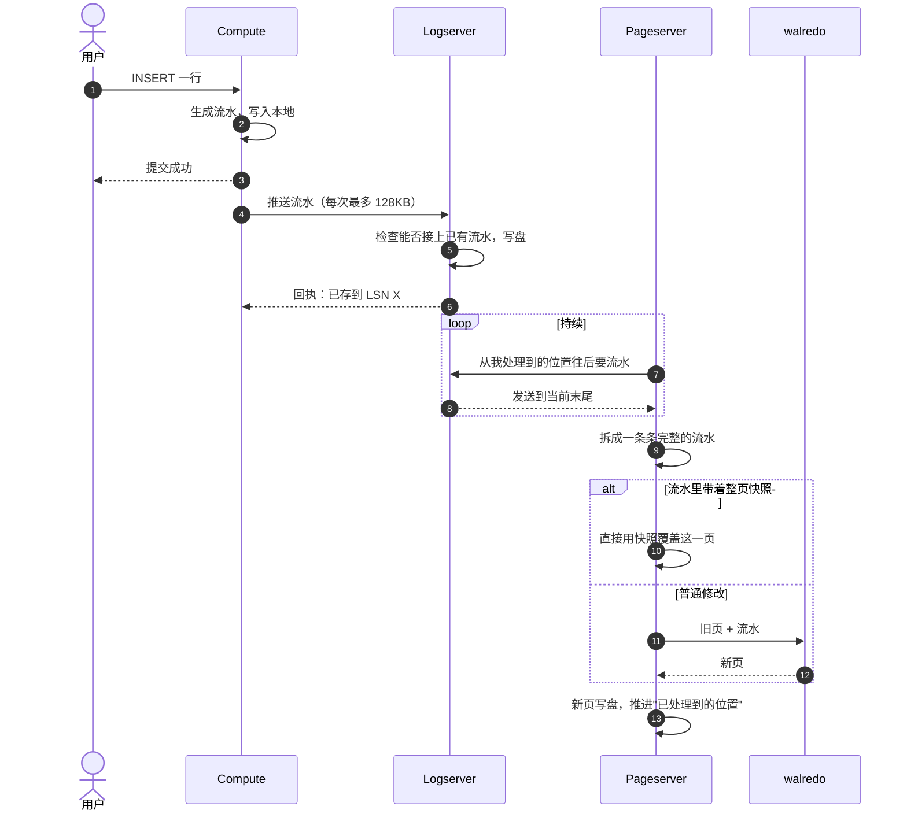
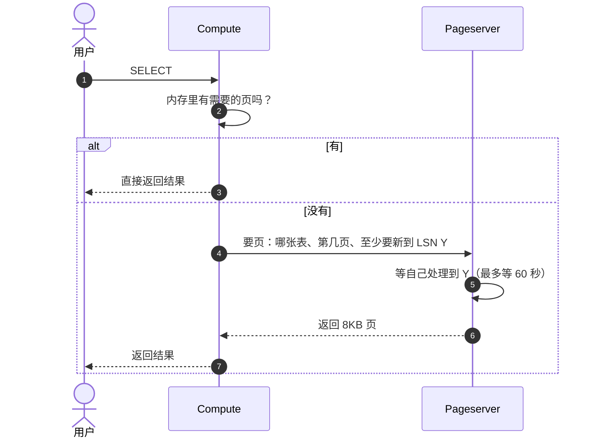
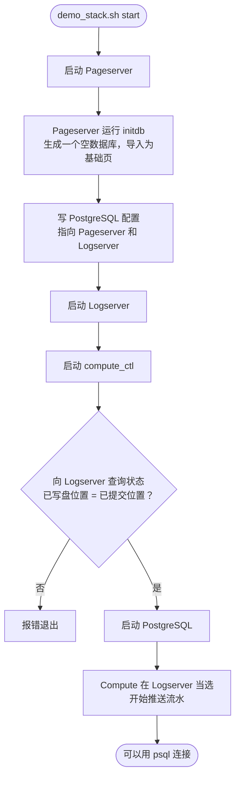

# 存算分离数据库 Demo：产品设计说明

> 

## 

```mermaid
flowchart LR
  subgraph A["传统 PostgreSQL：一台机器全包"]
    direction TB
    A1["SQL 计算"] --- A2["流水账 WAL"] --- A3["数据文件"]
  end
  subgraph B["存算分离：三个角色各管一件事"]
    direction TB
    B1["Compute<br/>SQL 计算"] -->|"推送流水"| B2["Logserver<br/>保存流水"]
    B2 -->|"转发流水"| B3["Pageserver<br/>保存数据页"]
    B1 -->|"按页读取"| B3
  end
```

## 写入流程

```mermaid
sequenceDiagram
  autonumber
  actor U as 用户
  participant PG as Compute
  participant LS as Logserver
  participant PS as Pageserver
  participant R as walredo
  U->>PG: INSERT 一行
  PG->>PG: 生成流水，写入本地
  PG-->>U: 提交成功
  PG->>LS: 推送流水（每次最多 128KB）
  LS->>LS: 检查能否接上已有流水，写盘
  LS-->>PG: 回执：已存到 LSN X
  loop 持续
    PS->>LS: 从我处理到的位置往后要流水
    LS-->>PS: 发送到当前末尾
  end
  PS->>PS: 拆成一条条完整的流水
  alt 流水里带着整页快照
    PS->>PS: 直接用快照覆盖这一页
  else 普通修改
    PS->>R: 旧页 + 流水
    R-->>PS: 新页
  end
  PS->>PS: 新页写盘，推进"已处理到的位置"
```

##  读取流程

```mermaid
sequenceDiagram
  autonumber
  actor U as 用户
  participant PG as Compute
  participant PS as Pageserver
  U->>PG: SELECT
  PG->>PG: 内存里有需要的页吗？
  alt 有
    PG-->>U: 直接返回结果
  else 没有
    PG->>PS: 要页：哪张表、第几页、至少要新到 LSN Y
    PS->>PS: 等自己处理到 Y（最多等 60 秒）
    PS-->>PG: 返回 8KB 页
    PG-->>U: 返回结果
  end
```

## 启动流程

`scripts/demo_stack.sh start` 按下面的顺序启动整套系统：

```mermaid
flowchart TD
  s(["demo_stack.sh start"]) --> p1["启动 Pageserver"]
  p1 --> p2["Pageserver 运行 initdb<br/>生成一个空数据库，导入为基础页"]
  p2 --> p3["写 PostgreSQL 配置<br/>指向 Pageserver 和 Logserver"]
  p3 --> l1["启动 Logserver"]
  l1 --> c1["启动 compute_ctl"]
  c1 --> c2{"向 Logserver 查询状态<br/>已写盘位置 = 已提交位置？"}
  c2 -->|"否"| x["报错退出"]
  c2 -->|"是"| c3["启动 PostgreSQL"]
  c3 --> c4["Compute 在 Logserver 当选<br/>开始推送流水"]
  c4 --> ok(["可以用 psql 连接"])
```

##  
